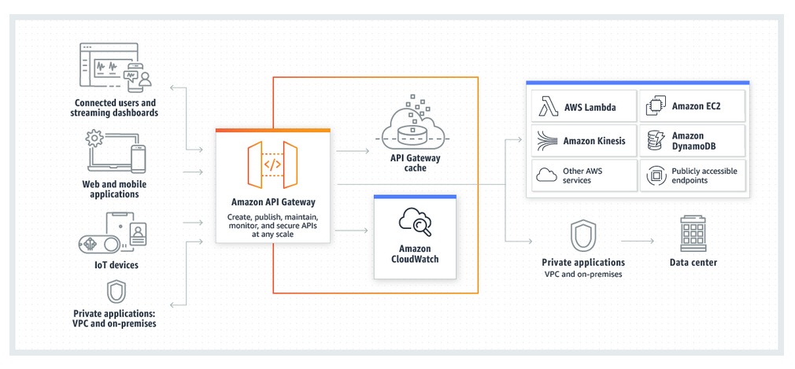

# API - AWS API Gateway

Amazon API Gateway is an AWS service for creating, publishing, maintaining, monitoring, and securing REST, HTTP, and WebSocket APIs at any scale. API developers can create APIs that access AWS or other web services, as well as data stored in the AWS Cloud. As an API Gateway API developer, you can create APIs for use in your own client applications. Or you can make your APIs available to third-party app developers.

API Gateway creates RESTful APIs that:

- Are HTTP-based.

- Enable stateless client-server communication.

- Implement standard HTTP methods such as GET, POST, PUT, PATCH, and DELETE.

API Gateway creates WebSocket APIs that:

- Adhere to the WebSocket protocol, which enables stateful, full-duplex communication between client and server.

- Route incoming messages based on message content.

---

## Architecture of API Gateway

This diagram illustrates how the APIs you build in Amazon API Gateway provide you or your developer customers with an integrated and consistent developer experience for building AWS serverless applications. API Gateway handles all the tasks involved in accepting and processing up to hundreds of thousands of concurrent API calls. These tasks include traffic management, authorization and access control, monitoring, and API version management.

API Gateway acts as a "front door" for applications to access data, business logic, or functionality from your backend services, such as workloads running on Amazon Elastic Compute Cloud (Amazon EC2), code running on AWS Lambda, any web application, or real-time communication applications.

---

## Features of API Gateway

- Support for stateful (WebSocket) and stateless (HTTP and REST) APIs.

- Powerful, flexible authentication mechanisms, such as AWS Identity and Access Management policies, Lambda authorizer functions, and Amazon Cognito user pools.

- Developer portal for publishing your APIs.

- Canary release deployments for safely rolling out changes.

- CloudTrail logging and monitoring of API usage and API changes.

- CloudWatch access logging and execution logging, including the ability to set alarms.

- Ability to use AWS CloudFormation templates to enable API creation.

- Support for custom domain names.

- Integration with AWS WAF for protecting your APIs against common web exploits.

- Integration with AWS X-Ray for understanding and triaging performance latencies.

---

## Concepts

- API deployment

  A point-in-time snapshot of your API Gateway API. To be available for clients to use, the deployment must be associated with one or more API stages.

- API developer

  Your AWS account that owns an API Gateway deployment (for example, a service provider that also supports programmatic access).

- API endpoint

  A hostname for an API in API Gateway that is deployed to a specific Region. The hostname is of the form {api-id}.execute-api.{region}.amazonaws.com. The following types of API endpoints are supported:

  - Edge-optimized API endpoint

  - Private API endpoint

  - Regional API endpoint

- API key

  An alphanumeric string that API Gateway uses to identify an app developer who uses your REST or WebSocket API. API Gateway can generate API keys on your behalf, or you can import them from a CSV file. You can use API keys together with Lambda authorizers or usage plans to control access to your APIs.

- API stage

  A logical reference to a lifecycle state of your API (for example, 'dev', 'prod', 'beta', 'v2'). API stages are identified by API ID and stage name.

- App developer

  An app creator who may or may not have an AWS account and interacts with the API that you, the API developer, have deployed. App developers are your customers. An app developer is typically identified by an API key.

- Callback URL

  When a new client is connected to through a WebSocket connection, you can call an integration in API Gateway to store the client's callback URL. You can then use that callback URL to send messages to the client from the backend system.

- Developer portal

  An application that allows your customers to register, discover, and subscribe to your API products (API Gateway usage plans), manage their API keys, and view their usage metrics for your APIs.

- Edge-optimized API endpoint

  The default hostname of an API Gateway API that is deployed to the specified Region while using a CloudFront distribution to facilitate client access typically from across AWS Regions. API requests are routed to the nearest CloudFront Point of Presence (POP), which typically improves connection time for geographically diverse clients.

- Integration request

  The internal interface of a WebSocket API route or REST API method in API Gateway, in which you map the body of a route request or the parameters and body of a method request to the formats required by the backend.

- Integration response

  The internal interface of a WebSocket API route or REST API method in API Gateway, in which you map the status codes, headers, and payload that are received from the backend to the response format that is returned to a client app.

- Mapping template

  A script in Velocity Template Language (VTL) that transforms a request body from the frontend data format to the backend data format, or that transforms a response body from the backend data format to the frontend data format. Mapping templates can be specified in the integration request or in the integration response. They can reference data made available at runtime as context and stage variables.

  The mapping can be as simple as an identity transform that passes the headers or body through the integration as-is from the client to the backend for a request. The same is true for a response, in which the payload is passed from the backend to the client.

- Method request

  The public interface of an API method in API Gateway that defines the parameters and body that an app developer must send in requests to access the backend through the API.

- Method response

  The public interface of a REST API that defines the status codes, headers, and body models that an app developer should expect in responses from the API.

- Mock integration

  In a mock integration, API responses are generated from API Gateway directly, without the need for an integration backend. As an API developer, you decide how API Gateway responds to a mock integration request. For this, you configure the method's integration request and integration response to associate a response with a given status code.

- Model

  A data schema specifying the data structure of a request or response payload. A model is required for generating a strongly typed SDK of an API. It is also used to validate payloads. A model is convenient for generating a sample mapping template to initiate creation of a production mapping template. Although useful, a model is not required for creating a mapping template.

- Private API endpoint

  An API endpoint that is exposed through interface VPC endpoints and allows a client to securely access private API resources inside a VPC. Private APIs are isolated from the public internet, and they can only be accessed using VPC endpoints for API Gateway that have been granted access.

- Private integration

  An API Gateway integration type for a client to access resources inside a customer's VPC through a private REST API endpoint without exposing the resources to the public internet.

- Proxy integration

  A simplified API Gateway integration configuration. You can set up a proxy integration as an HTTP proxy integration or a Lambda proxy integration.

  For HTTP proxy integration, API Gateway passes the entire request and response between the frontend and an HTTP backend. For Lambda proxy integration, API Gateway sends the entire request as input to a backend Lambda function. API Gateway then transforms the Lambda function output to a frontend HTTP response.

  In REST APIs, proxy integration is most commonly used with a proxy resource, which is represented by a greedy path variable (for example, {proxy+}) combined with a catch-all ANY method.

- Quick create

  You can use quick create to simplify creating an HTTP API. Quick create creates an API with a Lambda or HTTP integration, a default catch-all route, and a default stage that is configured to automatically deploy changes.

- Regional API endpoint

  The host name of an API that is deployed to the specified Region and intended to serve clients, such as EC2 instances, in the same AWS Region. API requests are targeted directly to the Region-specific API Gateway API without going through any CloudFront distribution. For in-Region requests, a Regional endpoint bypasses the unnecessary round trip to a CloudFront distribution.

  In addition, you can apply latency-based routing on Regional endpoints to deploy an API to multiple Regions using the same Regional API endpoint configuration, set the same custom domain name for each deployed API, and configure latency-based DNS records in Route 53 to route client requests to the Region that has the lowest latency.

- Route

  A WebSocket route in API Gateway is used to direct incoming messages to a specific integration, such as an AWS Lambda function, based on the content of the message. When you define your WebSocket API, you specify a route key and an integration backend. The route key is an attribute in the message body. When the route key is matched in an incoming message, the integration backend is invoked.

  A default route can also be set for non-matching route keys or to specify a proxy model that passes the message through as-is to backend components that perform the routing and process the request.

- Route request

  The public interface of a WebSocket API method in API Gateway that defines the body that an app developer must send in the requests to access the backend through the API.

- Route response

  The public interface of a WebSocket API that defines the status codes, headers, and body models that an app developer should expect from API Gateway.

- Usage plan

  A usage plan provides selected API clients with access to one or more deployed REST or WebSocket APIs. You can use a usage plan to configure throttling and quota limits, which are enforced on individual client API keys.

- WebSocket connection

  API Gateway maintains a persistent connection between clients and API Gateway itself. There is no persistent connection between API Gateway and backend integrations such as Lambda functions. Backend services are invoked as needed, based on the content of messages received from clients.
