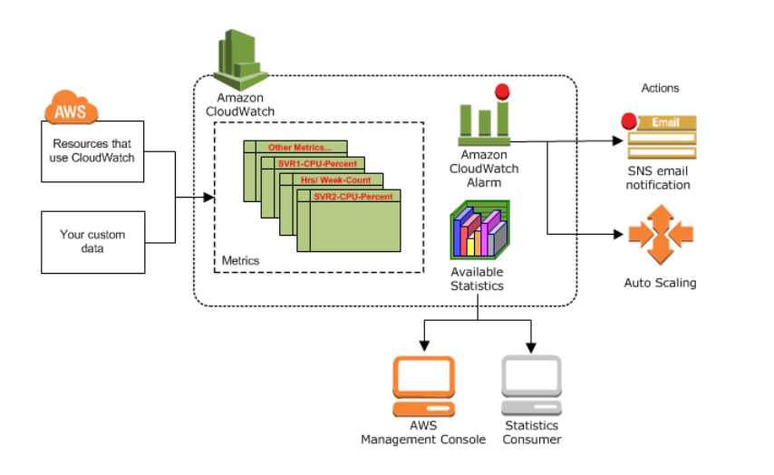

# AWS Cloudwatch

Amazon CloudWatch monitors your Amazon Web Services (AWS) resources and the applications you run on AWS in real time. You can use CloudWatch to collect and track metrics, which are variables you can measure for your resources and applications.

You can create alarms that watch metrics and send notifications or automatically make changes to the resources you are monitoring when a threshold is breached. With CloudWatch, you gain system-wide visibility into resource utilization, application performance, and operational health.

AWS Cloud computing resources are housed in highly available data center facilities. To provide additional scalability and reliability, each data center facility is located in a specific geographical area, known as a Region. Each Region is designed to be completely isolated from the other Regions, to achieve the greatest possible failure isolation and stability. Metrics are stored separately in Regions, but you can use CloudWatch cross-Region functionality to aggregate statistics from different Regions.

---

## Concepts

### Namespaces

A namespace is a container for CloudWatch metrics. Metrics in different namespaces are isolated from each other, so that metrics from different applications are not mistakenly aggregated into the same statistics.

There is no default namespace. You must specify a namespace for each data point you publish to CloudWatch. You can specify a namespace name when you create a metric.

The AWS namespaces typically use the following naming convention: AWS/service.

### Metrics

Metrics are the fundamental concept in CloudWatch. A metric represents a time-ordered set of data points that are published to CloudWatch. Think of a metric as a variable to monitor, and the data points as representing the values of that variable over time. For example, the CPU usage of a particular EC2 instance is one metric provided by Amazon EC2. The data points themselves can come from any application or business activity from which you collect data.

Metrics exist only in the Region in which they are created. Metrics cannot be deleted, but they automatically expire after 15 months if no new data is published to them. Data points older than 15 months expire on a rolling basis; as new data points come in, data older than 15 months is dropped.

### Time stamps

Each metric data point must be associated with a time stamp. The time stamp can be up to two weeks in the past and up to two hours into the future. If you do not provide a time stamp, CloudWatch creates a time stamp for you based on the time the data point was received.

Time stamps are dateTime objects, with the complete date plus hours, minutes, and seconds (for example, 2016-10-31T23:59:59Z).

### Metrics retention

CloudWatch retains metric data as follows:

- Data points with a period of less than 60 seconds are available for 3 hours. These data points are high-resolution custom metrics.

- Data points with a period of 60 seconds (1 minute) are available for 15 days

- Data points with a period of 300 seconds (5 minute) are available for 63 days

- Data points with a period of 3600 seconds (1 hour) are available for 455 days (15 months)

Data points that are initially published with a shorter period are aggregated together for long-term storage. For example, if you collect data using a period of 1 minute, the data remains available for 15 days with 1-minute resolution. After 15 days this data is still available, but is aggregated and is retrievable only with a resolution of 5 minutes. After 63 days, the data is further aggregated and is available with a resolution of 1 hour.

### Dimensions

A dimension is a name/value pair that is part of the identity of a metric. You can assign up to 30 dimensions to a metric.

Every metric has specific characteristics that describe it, and you can think of dimensions as categories for those characteristics. Dimensions help you design a structure for your statistics plan. Because dimensions are part of the unique identifier for a metric, whenever you add a unique name/value pair to one of your metrics, you are creating a new variation of that metric.

### Dimension combinations

CloudWatch treats each unique combination of dimensions as a separate metric, even if the metrics have the same metric name. You can only retrieve statistics using combinations of dimensions that you specifically published. When you retrieve statistics, specify the same values for the namespace, metric name, and dimension parameters that were used when the metrics were created. You can also specify the start and end times for CloudWatch to use for aggregation.

### Resolution

Each metric is one of the following:

- Standard resolution, with data having a one-minute granularity

- High resolution, with data at a granularity of one second

Metrics produced by AWS services are standard resolution by default. When you publish a custom metric, you can define it as either standard resolution or high resolution. When you publish a high-resolution metric, CloudWatch stores it with a resolution of 1 second, and you can read and retrieve it with a period of 1 second, 5 seconds, 10 seconds, 30 seconds, or any multiple of 60 seconds.

### Statistics

Statistics are metric data aggregations over specified periods of time. CloudWatch provides statistics based on the metric data points provided by your custom data or provided by other AWS services to CloudWatch. Aggregations are made using the namespace, metric name, dimensions, and the data point unit of measure, within the time period you specify.

### Units

Each statistic has a unit of measure. Example units include Bytes, Seconds, Count, and Percent.

You can specify a unit when you create a custom metric. If you do not specify a unit, CloudWatch uses None as the unit. Units help provide conceptual meaning to your data. Though CloudWatch attaches no significance to a unit internally, other applications can derive semantic information based on the unit.

Metric data points that specify a unit of measure are aggregated separately. When you get statistics without specifying a unit, CloudWatch aggregates all data points of the same unit together. If you have two otherwise identical metrics with different units, two separate data streams are returned, one for each unit.

### Periods

A period is the length of time associated with a specific Amazon CloudWatch statistic. Each statistic represents an aggregation of the metrics data collected for a specified period of time. Periods are defined in numbers of seconds, and valid values for period are 1, 5, 10, 30, or any multiple of 60.You can adjust how the data is aggregated by varying the length of the period. A period can be as short as one second or as long as one day (86,400 seconds). The default value is 60 seconds.

Only custom metrics that you define with a storage resolution of 1 second support sub-minute periods. Even though the option to set a period below 60 is always available in the console, you should select a period that aligns to how the metric is stored.

When you retrieve statistics, you can specify a period, start time, and end time. These parameters determine the overall length of time associated with the statistics. The default values for the start time and end time get you the last hour's worth of statistics. The values that you specify for the start time and end time determine how many periods CloudWatch returns.

### Aggregation

Amazon CloudWatch aggregates statistics according to the period length that you specify when retrieving statistics. You can publish as many data points as you want with the same or similar time stamps. CloudWatch aggregates them according to the specified period length. CloudWatch does not automatically aggregate data across Regions, but you can use metric math to aggregate metrics from different Regions.

Amazon CloudWatch doesn't differentiate the source of a metric. If you publish a metric with the same namespace and dimensions from different sources, CloudWatch treats this as a single metric. This can be useful for service metrics in a distributed, scaled system.

### Percentiles

A percentile indicates the relative standing of a value in a dataset. For example, the 95th percentile means that 95 percent of the data is lower than this value and 5 percent of the data is higher than this value. Percentiles help you get a better understanding of the distribution of your metric data.Percentiles are often used to isolate anomalies.

Some CloudWatch metrics support percentiles as a statistic. For these metrics, you can monitor your system and applications using percentiles as you would when using the other CloudWatch statistics (Average, Minimum, Maximum, and Sum).

### Alarms

You can use an alarm to automatically initiate actions on your behalf. An alarm watches a single metric over a specified time period, and performs one or more specified actions, based on the value of the metric relative to a threshold over time. The action is a notification sent to an Amazon SNS topic or an Auto Scaling policy. You can also add alarms to dashboards.

Alarms invoke actions for sustained state changes only. CloudWatch alarms do not invoke actions simply because they are in a particular state. The state must have changed and been maintained for a specified number of periods.
