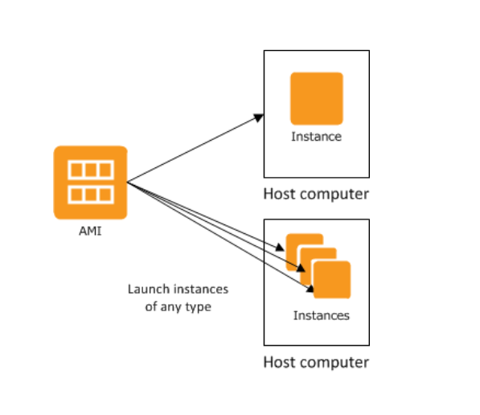
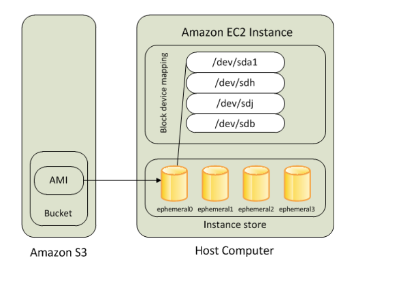
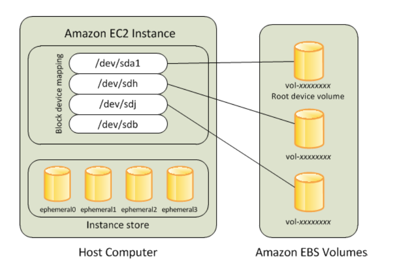
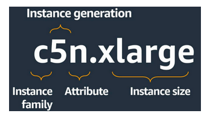
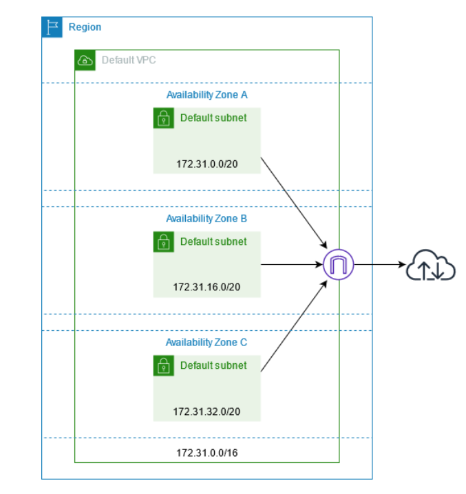

# EC2 - AWS Elastic Compute Cloud

Amazon Elastic Compute Cloud (Amazon EC2) provides scalable computing capacity in the Amazon Web Services (AWS) Cloud. Using Amazon EC2 eliminates your need to invest in hardware up front, so you can develop and deploy applications faster. You can use Amazon EC2 to launch as many or as few virtual servers as you need, configure security and networking, and manage storage. Amazon EC2 enables you to scale up or down to handle changes in requirements or spikes in popularity, reducing your need to forecast traffic.

## Features of Amazon EC2

Amazon EC2 provides the following features:

- Virtual computing environments, known as instances

- Preconfigured templates for your instances, known as Amazon Machine Images (AMIs), that package the bits you need for your server (including the operating system and additional software)

- Various configurations of CPU, memory, storage, and networking capacity for your instances, known as instance types

- Secure login information for your instances using key pairs (AWS stores the public key, and you store the private key in a secure place)

- Storage volumes for temporary data that's deleted when you stop, hibernate, or terminate your instance, known as instance store volumes

- Persistent storage volumes for your data using Amazon Elastic Block Store (Amazon EBS), known as Amazon EBS volumes

- Multiple physical locations for your resources, such as instances and Amazon EBS volumes, known as Regions and Availability Zones

- A firewall that enables you to specify the protocols, ports, and source IP ranges that can reach your instances using security groups

- Static IPv4 addresses for dynamic cloud computing, known as Elastic IP addresses

- Metadata, known as tags, that you can create and assign to your Amazon EC2 resources

- Virtual networks you can create that are logically isolated from the rest of the AWS Cloud, and that you can optionally connect to your own network, known as virtual private clouds (VPCs)

---

## Instances and AMIs

An Amazon Machine Image (AMI) is a template that contains a software configuration (for example, an operating system, an application server, and applications). From an AMI, you launch an instance, which is a copy of the AMI running as a virtual server in the cloud. You can launch multiple instances of an AMI, as shown in the following figure.

Your instances keep running until you stop, hibernate, or terminate them, or until they fail. If an instance fails, you can launch a new one from the AMI.

---

## Instances

An instance is a virtual server in the cloud. Its configuration at launch is a copy of the AMI that you specified when you launched the instance.

You can launch different types of instances from a single AMI. An instance type essentially determines the hardware of the host computer used for your instance. Each instance type offers different compute and memory capabilities. Select an instance type based on the amount of memory and computing power that you need for the application or software that you plan to run on the instance.

### Amazon EC2 instance root device volume

When you launch an instance, the root device volume contains the image used to boot the instance. When we introduced Amazon EC2, all AMIs were backed by Amazon EC2 instance store, which means the root device for an instance launched from the AMI is an instance store volume created from a template stored in Amazon S3. After we introduced Amazon EBS, we introduced AMIs that are backed by Amazon EBS. This means that the root device for an instance launched from the AMI is an Amazon EBS volume created from an Amazon EBS snapshot.

You can choose between AMIs backed by Amazon EC2 instance store and AMIs backed by Amazon EBS. We recommend that you use AMIs backed by Amazon EBS, because they launch faster and use persistent storage.

---

## AMIs

Amazon Web Services (AWS) publishes many Amazon Machine Images (AMIs) that contain common software configurations for public use. In addition, members of the AWS developer community have published their own custom AMIs. You can also create your own custom AMI or AMIs; doing so enables you to quickly and easily start new instances that have everything you need.

All AMIs are categorized as either backed by Amazon EBS, which means that the root device for an instance launched from the AMI is an Amazon EBS volume, or backed by instance store, which means that the root device for an instance launched from the AMI is an instance store volume created from a template stored in Amazon S3.

---

## Instance types

When you launch an instance, the instance type that you specify determines the hardware of the host computer used for your instance. Each instance type offers different compute, memory, and storage capabilities, and is grouped in an instance family based on these capabilities.

Amazon EC2 dedicates some resources of the host computer, such as CPU, memory, and instance storage, to a particular instance. Amazon EC2 shares other resources of the host computer, such as the network and the disk subsystem, among instances. If each instance on a host computer tries to use as much of one of these shared resources as possible, each receives an equal share of that resource. However, when a resource is underused, an instance can consume a higher share of that resource while it's available.

### Instance type names

Amazon EC2 provides a variety of instance types so you can choose the type that best meets your requirements. Instance types are named based on their family, generation, additional capabilities, and size. The first position of the instance type name indicates the instance family, for example c. The second position indicates the instance generation, for example 5. The remaining letters before the period indicate additional capabilities, such as local NVMe storage or full control over c-states. After the period (.) is the instance size, which is either a number followed by a size, such as 9xlarge, or for metal instances the word metal.

## Tag your Amazon EC2 resources

To help you manage your instances, images, and other Amazon EC2 resources, you can assign your own metadata to each resource in the form of tags. Tags enable you to categorize your AWS resources in different ways, for example, by purpose, owner, or environment. This is useful when you have many resources of the same type—you can quickly identify a specific resource based on the tags that you've assigned to it.

A tag is a label that you assign to an AWS resource. Each tag consists of a key and an optional value, both of which you define.

After you delete a resource, its tags might remain visible in the console, API, and CLI output for a short period. These tags will be gradually disassociated from the resource and be permanently deleted.

---

## Key pairs

A key pair, consisting of a public key and a private key, is a set of security credentials that you use to prove your identity when connecting to an Amazon EC2 instance. Amazon EC2 stores the public key on your instance, and you store the private key. For Linux instances, the private key allows you to securely SSH into your instance. As an alternative to key pairs, you can use AWS Systems Manager Session Manager to connect to your instance with an interactive one-click browser-based shell or the AWS Command Line Interface (AWS CLI).

When you launch an instance, you are prompted for a key pair. If you plan to connect to the instance using SSH, you must specify a key pair. You can choose an existing key pair or create a new one. When your instance boots for the first time, the public key that you specified at launch is placed on your Linux instance in an entry within ~/.ssh/authorized_keys. When you connect to your Linux instance using SSH, to log in you must specify the private key that corresponds to the public key.

---

## Security groups

A security group acts as a virtual firewall for your EC2 instances to control incoming and outgoing traffic. Inbound rules control the incoming traffic to your instance, and outbound rules control the outgoing traffic from your instance. When you launch an instance, you can specify one or more security groups. If you don't specify a security group, Amazon EC2 uses the default security group. You can add rules to each security group that allow traffic to or from its associated instances. You can modify the rules for a security group at any time. New and modified rules are automatically applied to all instances that are associated with the security group. When Amazon EC2 decides whether to allow traffic to reach an instance, it evaluates all of the rules from all of the security groups that are associated with the instance.

When you launch an instance in a VPC, you must specify a security group that's created for that VPC. After you launch an instance, you can change its security groups. Security groups are associated with network interfaces. Changing an instance's security groups changes the security groups associated with the primary network interface (eth0).

The following are the characteristics of security group rules:

- By default, security groups contain outbound rules that allow all outbound traffic. You can delete these rules. Note that Amazon EC2 blocks traffic on port 25 by default.

- Security group rules are always permissive; you can't create rules that deny access.

- Security group rules enable you to filter traffic based on protocols and port numbers.

- Security groups are stateful—if you send a request from your instance, the response traffic for that request is allowed to flow in regardless of inbound security group rules. For VPC security groups, this also means that responses to allowed inbound traffic are allowed to flow out, regardless of outbound rules.

- You can add and remove rules at any time. Your changes are automatically applied to the instances that are associated with the security group.

- The effect of some rule changes can depend on how the traffic is tracked.

- When you associate multiple security groups with an instance, the rules from each security group are effectively aggregated to create one set of rules. Amazon EC2 uses this set of rules to determine whether to allow access.

For each rule, you specify the following:

- Name: The name for the security group (for example, "my-security-group").A name can be up to 255 characters in length. Allowed characters are a-z, A-Z, 0-9, spaces, and .\_-:/()#,@[]+=;{}!$\*. When the name contains trailing spaces, we trim the spaces when we save the name. For example, if you enter "Test Security Group " for the name, we store it as "Test Security Group".

- Protocol: The protocol to allow. The most common protocols are 6 (TCP), 17 (UDP), and 1 (ICMP).

- Port range: For TCP, UDP, or a custom protocol, the range of ports to allow. You can specify a single port number (for example, 22), or range of port numbers (for example, 7000-8000).

- ICMP type and code: For ICMP, the ICMP type and code. For example, use type 8 for ICMP Echo Request or type 128 for ICMPv6 Echo Request.

- Source or destination: The source (inbound rules) or destination (outbound rules) for the traffic to allow. Specify one of the following:

  - A single IPv4 address. You must use the /32 prefix length. For example, 203.0.113.1/32.

  - A single IPv6 address. You must use the /128 prefix length. For example, 2001:db8:1234:1a00::123/128.

  - A range of IPv4 addresses, in CIDR block notation. For example, 203.0.113.0/24.

  - A range of IPv6 addresses, in CIDR block notation. For example, 2001:db8:1234:1a00::/64.

  - The ID of a prefix list. For example, pl-1234abc1234abc123. For more information, see Prefix lists in the Amazon VPC User Guide.

  - The ID of a security group (referred to here as the specified security group). For example, the current security group, a security group from the same VPC, or a security group for a peered VPC. This allows traffic based on the private IP addresses of the resources associated with the specified security group. This does not add rules from the specified security group to the current security group.

- (Optional) Description: You can add a description for the rule, which can help you identify it later. A description can be up to 255 characters in length. Allowed characters are a-z, A-Z, 0-9, spaces, and .\_-:/()#,@[]+=;{}!$\*.

When you create a security group rule, AWS assigns a unique ID to the rule. You can use the ID of a rule when you use the API or CLI to modify or delete the rule.

---

## Elastic IP addresses

An Elastic IP address is a static IPv4 address designed for dynamic cloud computing. An Elastic IP address is allocated to your AWS account, and is yours until you release it. By using an Elastic IP address, you can mask the failure of an instance or software by rapidly remapping the address to another instance in your account. Alternatively, you can specify the Elastic IP address in a DNS record for your domain, so that your domain points to your instance.

An Elastic IP address is a public IPv4 address, which is reachable from the internet. If your instance does not have a public IPv4 address, you can associate an Elastic IP address with your instance to enable communication with the internet.

## Virtual private clouds

Amazon Virtual Private Cloud (Amazon VPC) enables you to define a virtual network in your own logically isolated area within the AWS cloud, known as a virtual private cloud or VPC. You can create AWS resources, such as Amazon EC2 instances, into the subnets of your VPC. Your VPC closely resembles a traditional network that you might operate in your own data center, with the benefits of using scalable infrastructure from AWS. You can configure your VPC; you can select its IP address range, create subnets, and configure route tables, network gateways, and security settings. You can connect instances in your VPC to the internet or to your own data center.

When you create your AWS account, we create a default VPC in each Region. A default VPC is a VPC that is already configured and ready for you to use. For example, there is a default subnet for each Availability Zone in each default VPC, an internet gateway attached to the VPC, and there's a route in the main route table that sends all traffic (0.0.0.0/0) to the internet gateway.

## Amazon Elastic Block Store (Amazon EBS)

Amazon Elastic Block Store (Amazon EBS) provides block level storage volumes for use with EC2 instances. EBS volumes behave like raw, unformatted block devices. You can mount these volumes as devices on your instances. EBS volumes that are attached to an instance are exposed as storage volumes that persist independently from the life of the instance. You can create a file system on top of these volumes, or use them in any way you would use a block device (such as a hard drive). You can dynamically change the configuration of a volume attached to an instance.

We recommend Amazon EBS for data that must be quickly accessible and requires long-term persistence. EBS volumes are particularly well-suited for use as the primary storage for file systems, databases, or for any applications that require fine granular updates and access to raw, unformatted, block-level storage. Amazon EBS is well suited to both database-style applications that rely on random reads and writes, and to throughput-intensive applications that perform long, continuous reads and writes.

## Amazon EC2 instance store

An instance store provides temporary block-level storage for your instance. This storage is located on disks that are physically attached to the host computer. Instance store is ideal for temporary storage of information that changes frequently, such as buffers, caches, scratch data, and other temporary content, or for data that is replicated across a fleet of instances, such as a load-balanced pool of web servers.

An instance store consists of one or more instance store volumes exposed as block devices. The size of an instance store as well as the number of devices available varies by instance type.

You can specify instance store volumes for an instance only when you launch it. You can't detach an instance store volume from one instance and attach it to a different instance. Therefore, do not rely on instance store for valuable, long-term data. Instead, use more durable data storage, such as Amazon S3, Amazon EBS, or Amazon EFS.
