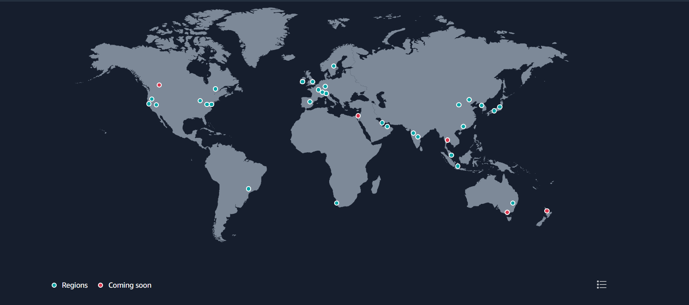
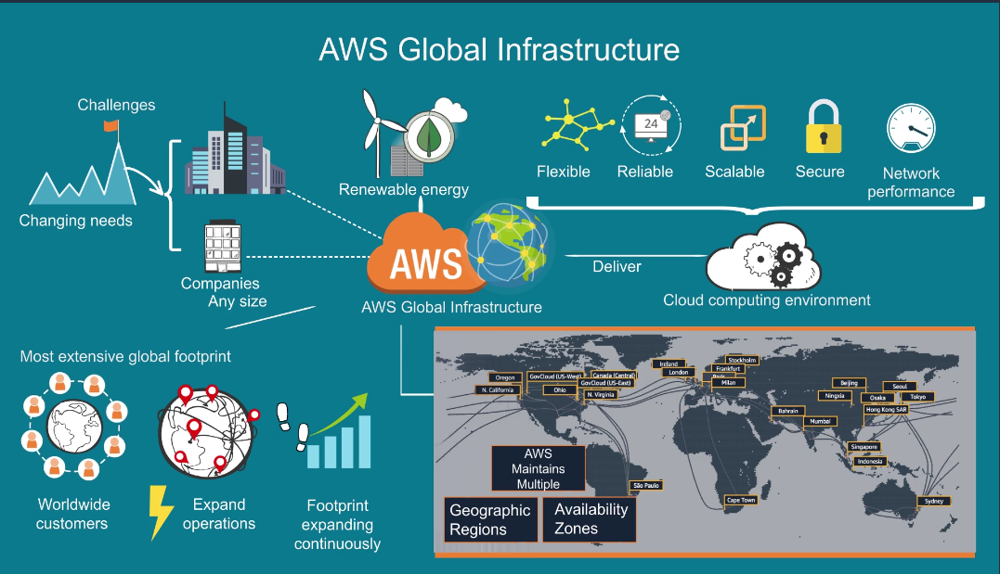
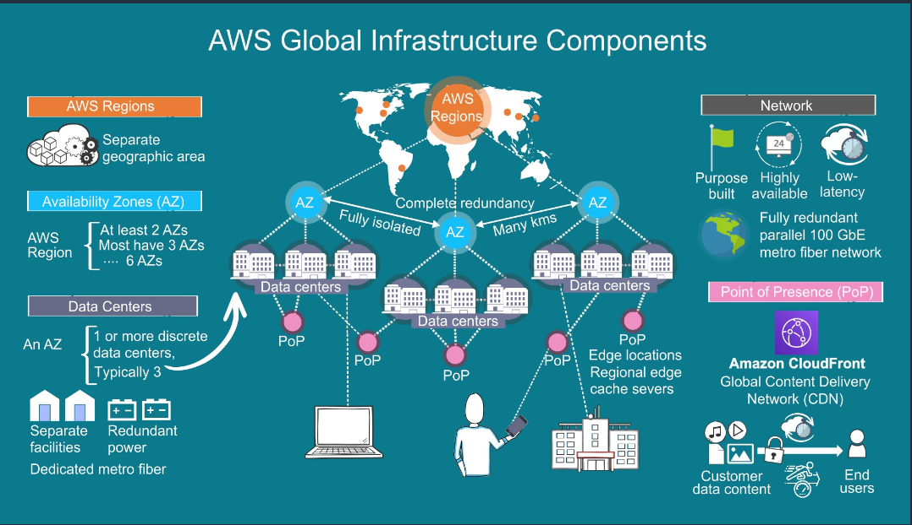
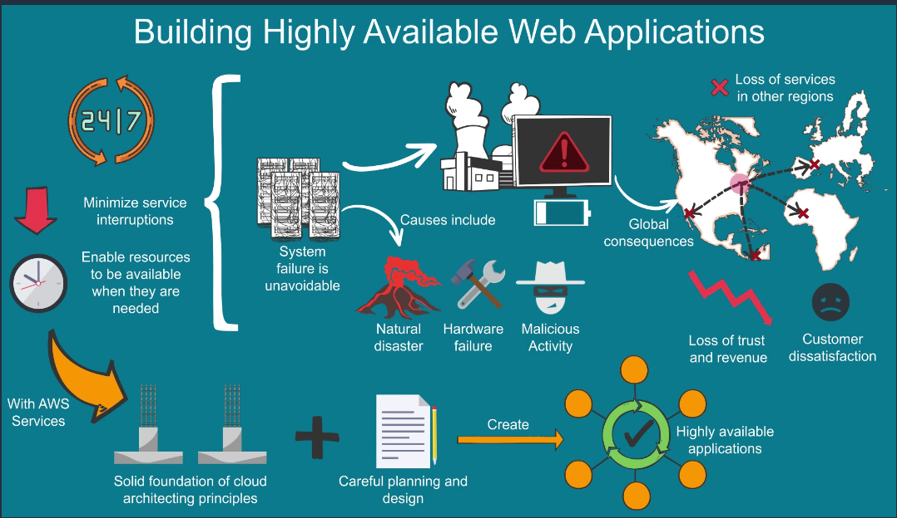
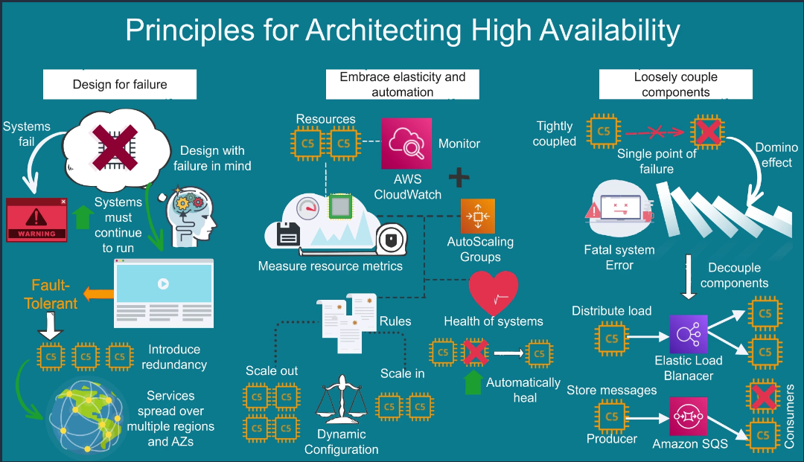
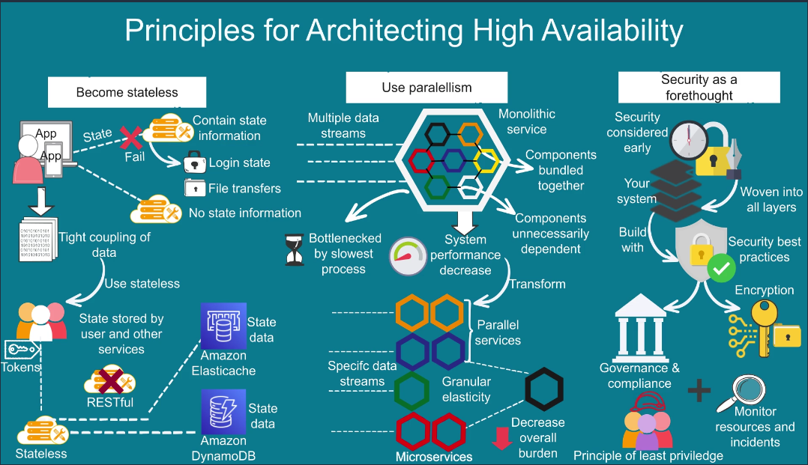

# AWS Global Infrastructure Map

The AWS Cloud spans 96 Availability Zones within 30 geographic regions around the world, with announced plans for 15 more Availability Zones and 5 more AWS Regions in Australia, Canada, Israel, New Zealand, and Thailand.

**AWS Region > Availability Zone > Data Center > Point of Presence**

## Regions

Each Region is designed to be isolated from the other Regions. This achieves the greatest possible fault tolerance and stability.

When you view your resources, you see only the resources that are tied to the Region that you specified. This is because Regions are isolated from each other, and we don't automatically replicate resources across Regions.

## Availability Zones

Each Region has multiple, isolated locations known as Availability Zones. The code for Availability Zone is its Region code followed by a letter identifier. For example, us-east-1a.

# Benefits

## Security

Security at AWS starts with our core infrastructure. Custom-built for the cloud and designed to meet the most stringent security requirements in the world, our infrastructure is monitored 24/7 to help ensure the confidentiality, integrity, and availability of your data. All data flowing across the AWS global network that interconnects our datacenters and Regions is automatically encrypted at the physical layer before it leaves our secured facilities. You can build on the most secure global infrastructure, knowing you always control your data, including the ability to encrypt it, move it, and manage retention at any time.

## Availability

AWS delivers the highest network availability of any cloud provider. Each region is fully isolated and comprised of multiple AZs, which are fully isolated partitions of our infrastructure. To better isolate any issues and achieve high availability, you can partition applications across multiple AZs in the same region. In addition, AWS control planes and the AWS management console are distributed across regions, and include regional API endpoints, which are designed to operate securely for at least 24 hours if isolated from the global control plane functions without requiring customers to access the region or its API endpoints via external networks during any isolation.

## Performance

The AWS Global Infrastructure is built for performance. AWS Regions offer low latency, low packet loss, and high overall network quality. This is achieved with a fully redundant 100 GbE fiber network backbone, often providing many terabits of capacity between Regions. AWS Local Zones and AWS Wavelength, with our telco providers, provide performance for applications that require single-digit millisecond latencies by delivering AWS infrastructure and services closer to end-users and 5G connected devices. Whatever your application needs, you can quickly spin up resources as you need them, deploying hundreds or even thousands of servers in minutes.

## Scalability

The AWS Global Infrastructure enables companies to be extremely flexible and take advantage of the conceptually infinite scalability of the cloud. Customers used to over provision to ensure they had enough capacity to handle their business operations at the peak level of activity. Now, they can provision the amount of resources that they actually need, knowing they can instantly scale up or down along with the needs of their business, which also reduces cost and improves the customer’s ability to meet their user’s demands. Companies can quickly spin up resources as they need them, deploying hundreds or even thousands of servers in minutes.

## Flexibility

The AWS Global Infrastructure gives you the flexibility of choosing how and where you want to run your workloads, and when you do you are using the same network, control plane, API’s, and AWS services. If you would like to run your applications globally you can choose from any of the AWS Regions and AZs. If you need to run your applications with single-digit millisecond latencies to mobile devices and end-users you can choose AWS Local Zones or AWS Wavelength. Or if you would like to run your applications on-premises you can choose AWS Outposts.

## Global footprint

AWS has the largest global infrastructure footprint of any provider, and this footprint is constantly increasing at a significant rate. When deploying your applications and workloads to the cloud, you have the flexibility in selecting a technology infrastructure that is closest to your primary target of users. You can run your workloads on the cloud that delivers the best support for the broadest set of applications, even those with the highest throughput and lowest latency requirements. And If your data lives off this planet, you can use AWS Ground Station, which provides satellite antennas in close proximity to AWS infrastructure Regions.

