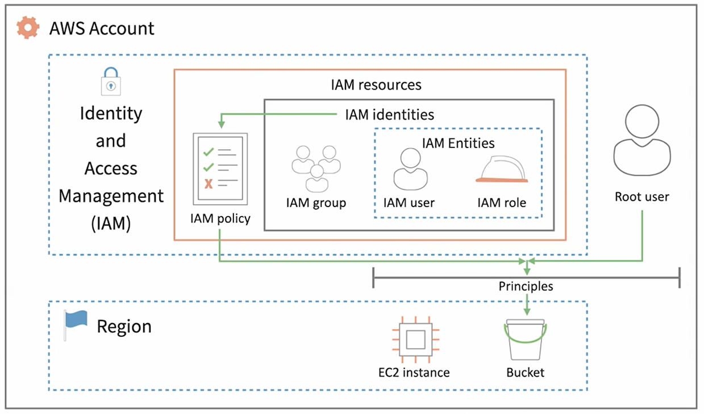

# IAM - AWS Identity and Access Management

AWS Identity and Access Management (IAM) is a web service that helps you securely control access to AWS resources. With IAM, you can centrally manage permissions that control which AWS resources users can access. You use IAM to control who is authenticated (signed in) and authorized (has permissions) to use resources.

---

## Request

When a principal tries to use the AWS Management Console, the AWS API, or the AWS CLI, that principal sends a request to AWS. The request includes the following information:

- Actions or operations
- Resources
- Principal
- Environment data
- Resource data

AWS gathers the request information into a request context, which is used to evaluate and authorize the request.

## Authentication

A principal must be authenticated (signed in to AWS) using their credentials to send a request to AWS. Some services, such as Amazon S3 and AWS STS, allow a few requests from anonymous users. However, they are the exception to the rule.

## Authorization

You must also be authorized (allowed) to complete your request. During authorization, AWS uses values from the request context to check for policies that apply to the request. It then uses the policies to determine whether to allow or deny the request. Most policies are stored in AWS as JSON documents and specify the permissions for principal entities. There are several types of policies that can affect whether a request is authorized. To provide your users with permissions to access the AWS resources in their own account, you need only identity-based policies. Resource-based policies are popular for granting cross-account access.

AWS checks each policy that applies to the context of your request. If a single permissions policy includes a denied action, AWS denies the entire request and stops evaluating. This is called an explicit deny. Because requests are denied by default, AWS authorizes your request only if every part of your request is allowed by the applicable permissions policies.

## Permissions and policies

The access management portion of AWS Identity and Access Management (IAM) helps you define what a principal entity is allowed to do in an account. A principal entity is a person or application that is authenticated using an IAM entity (user or role). Access management is often referred to as authorization. You manage access in AWS by creating policies and attaching them to IAM identities (users, groups of users, or roles) or AWS resources. A policy is an object in AWS that, when associated with an identity or resource, defines their permissions. AWS evaluates these policies when a principal uses an IAM entity (user or role) to make a request

## Policies and accounts

If you manage a single account in AWS, then you define the permissions within that account using policies. If you manage permissions across multiple accounts, it is more difficult to manage permissions for your users. You can use IAM roles, resource-based policies, or access control lists (ACLs) for cross-account permissions. However, if you own multiple accounts, we instead recommend using the AWS Organizations service to help you manage those permissions.

## Policies and users

IAM users are identities in the service. When you create an IAM user, they can't access anything in your account until you give them permission. You give permissions to a user by creating an identity-based policy, which is a policy that is attached to the user or a group to which the user belongs. Most users have multiple policies that together represent the permissions for that user.

Actions or resources that are not explicitly allowed are denied by default.

## Policies and groups

You can organize IAM users into IAM groups and attach a policy to a group. In that case, individual users still have their own credentials, but all the users in a group have the permissions that are attached to the group.

## Identity-based and resource-based policies

Identity-based policies are permissions policies that you attach to an IAM identity, such as an IAM user, group, or role. Resource-based policies are permissions policies that you attach to a resource such as an Amazon S3 bucket or an IAM role trust policy.

### Identity-based

#### > Managed policies

Standalone identity-based policies that you can attach to multiple users, groups, and roles in your AWS account.

- AWS managed policies => Managed policies that are created and managed by AWS.
- Customer managed policies => Managed policies that you create and manage in your AWS account. Customer managed policies provide more precise control over your policies than AWS managed policies. You can create, edit, and validate an IAM policy in the visual editor or by creating the JSON policy document directly.

#### > Inline policies

Policies that you create and manage and that are embedded directly into a single user, group, or role. In most cases, we don't recommend using inline policies.

### Resource-based policies

They control what actions a specified principal can perform on that resource and under what conditions. Resource-based policies are inline policies, and there are no managed resource-based policies.

---

IAM Resources

    The user, group, role, policy, and identity provider objects that are stored in IAM. As with other AWS services, you can add, edit, and remove resources from IAM.

IAM Identities

    The IAM resource objects that are used to identify and group. You can attach a policy to an IAM identity. These include users, groups, and roles.

IAM Entities

    The IAM resource objects that AWS uses for authentication. These include IAM users and roles.

Principals

    A person or application that uses the AWS account root user, an IAM user, or an IAM role to sign in and make requests to AWS. Principals include federated users and assumed roles.

Human users

    Also known as human identities; the people, administrators, developers, operators, and consumers of your applications.

Workload

    A collection of resources and code that delivers business value, such as an application or backend process. Can include applications, operational tools, and components.

IAM users

    The "identity" aspect of AWS Identity and Access Management (IAM) helps you with the question "Who is that user?", often referred to as authentication. IAM users are not separate accounts; they are users within your account. Each user can have its own password for access to the AWS Management Console. You can also create an individual access key for each user so that the user can make programmatic requests to work with resources in your account.

    IAM users are granted long term credentials to your AWS resources. As a best practice, you should require your human users to use temporary credentials when accessing AWS. You can use an identity provider for your human users to provide federated access to AWS accounts by assuming roles, which provide temporary credentials. For centralized access management, we recommend that you use AWS IAM Identity Center

IAM user groups

    An IAM group is an identity that specifies a collection of IAM users. You can't sign in as a group. You can use groups to specify permissions for multiple users at a time. Groups make permissions easier to manage for large sets of users.

IAM roles

    An IAM role is an identity within your AWS account that has specific permissions. It is similar to an IAM user, but is not associated with a specific person. You can temporarily assume an IAM role in the AWS Management Console by switching roles. You can assume a role by calling an AWS CLI or AWS API operation or by using a custom URL.

---

## Security best practices in IAM

- Require human users to use federation with an identity provider to access AWS using temporary credentials
- Require workloads to use temporary credentials with IAM roles to access AWS
- Rotate access keys regularly for use cases that require long-term credentials
- Require multi-factor authentication (MFA)
- Safeguard your root user credentials and don't use them for everyday tasks
- Apply least-privilege permissions
