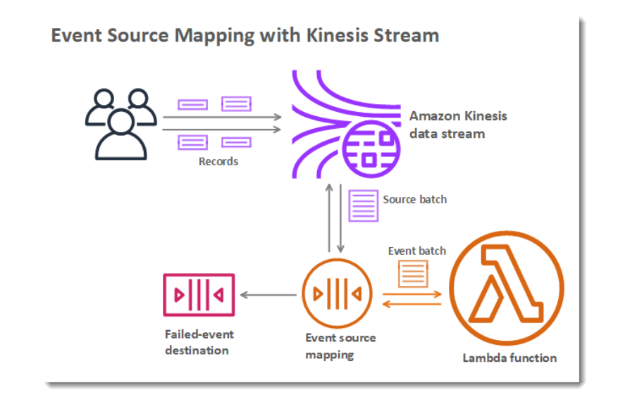
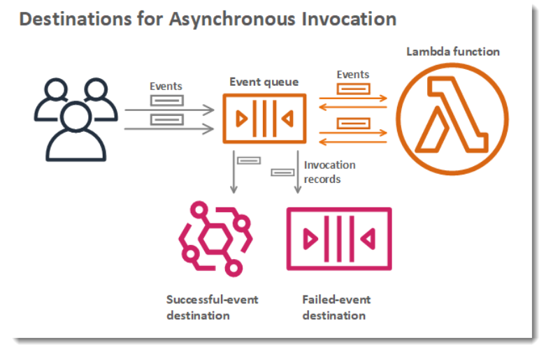

# LAMBDA - AWS Lambda

AWS Lambda is a compute service that lets you run code without provisioning or managing servers. Lambda runs your code on a high-availability compute infrastructure and performs all of the administration of the compute resources, including server and operating system maintenance, capacity provisioning and automatic scaling, and logging. With Lambda, you can run code for virtually any type of application or backend service.

You organize your code into Lambda functions. Lambda runs your function only when needed and scales automatically, from a few requests per day to thousands per second. You pay only for the compute time that you consume—there is no charge when your code is not running.

When using Lambda, you are responsible only for your code. Lambda manages the compute fleet that offers a balance of memory, CPU, network, and other resources to run your code. Because Lambda manages these resources, you cannot log in to compute instances or customize the operating system on provided runtimes. Lambda performs operational and administrative activities on your behalf, including managing capacity, monitoring, and logging your Lambda functions.

## Features

- Concurrency and scaling controls

  Concurrency and scaling controls such as concurrency limits and provisioned concurrency give you fine-grained control over the scaling and responsiveness of your production applications.

- Functions defined as container images

  Use your preferred container image tooling, workflows, and dependencies to build, test, and deploy your Lambda functions.

- Code signing

  Code signing for Lambda provides trust and integrity controls that let you verify that only unaltered code that approved developers have published is deployed in your Lambda functions.

- Lambda extensions

  You can use Lambda extensions to augment your Lambda functions. For example, use extensions to more easily integrate Lambda with your favorite tools for monitoring, observability, security, and governance.

- Function blueprints

  A function blueprint provides sample code that shows how to use Lambda with other AWS services or third-party applications. Blueprints include sample code and function configuration presets for Node.js and Python runtimes.

- Database access

  A database proxy manages a pool of database connections and relays queries from a function. This enables a function to reach high concurrency levels without exhausting database connections.

- File systems access

  You can configure a function to mount an Amazon Elastic File System (Amazon EFS) file system to a local directory. With Amazon EFS, your function code can access and modify shared resources safely and at high concurrency.

---

## Concepts

Lambda runs instances of your function to process events. You can invoke your function directly using the Lambda API, or you can configure an AWS service or resource to invoke your function.

### Function

A function is a resource that you can invoke to run your code in Lambda. A function has code to process the events that you pass into the function or that other AWS services send to the function.

### Trigger

A trigger is a resource or configuration that invokes a Lambda function. Triggers include AWS services that you can configure to invoke a function and event source mappings. An event source mapping is a resource in Lambda that reads items from a stream or queue and invokes a function.

### Event

An event is a JSON-formatted document that contains data for a Lambda function to process. The runtime converts the event to an object and passes it to your function code. When you invoke a function, you determine the structure and contents of the event. When an AWS service invokes your function, the service defines the shape of the event.

### Execution environment

An execution environment provides a secure and isolated runtime environment for your Lambda function. An execution environment manages the processes and resources that are required to run the function. The execution environment provides lifecycle support for the function and for any extensions associated with your function.

### Instruction set architecture

The instruction set architecture determines the type of computer processor that Lambda uses to run the function. Lambda provides a choice of instruction set architectures:

- arm64 – 64-bit ARM architecture, for the AWS Graviton2 processor.

- x86_64 – 64-bit x86 architecture, for x86-based processors.

### Deployment package

You deploy your Lambda function code using a deployment package. Lambda supports two types of deployment packages:

- A .zip file archive that contains your function code and its dependencies. Lambda provides the operating system and runtime for your function.

- A container image that is compatible with the Open Container Initiative (OCI) specification. You add your function code and dependencies to the image. You must also include the operating system and a Lambda runtime.

### Runtime

The runtime provides a language-specific environment that runs in an execution environment. The runtime relays invocation events, context information, and responses between Lambda and the function. You can use runtimes that Lambda provides, or build your own. If you package your code as a .zip file archive, you must configure your function to use a runtime that matches your programming language. For a container image, you include the runtime when you build the image.

### Layer

A Lambda layer is a .zip file archive that can contain additional code or other content. A layer can contain libraries, a custom runtime, data, or configuration files.

Layers provide a convenient way to package libraries and other dependencies that you can use with your Lambda functions. Using layers reduces the size of uploaded deployment archives and makes it faster to deploy your code. Layers also promote code sharing and separation of responsibilities so that you can iterate faster on writing business logic.

You can include up to five layers per function. Layers count towards the standard Lambda deployment size quotas. When you include a layer in a function, the contents are extracted to the /opt directory in the execution environment.

Functions deployed as a container image do not use layers. Instead, you package your preferred runtime, libraries, and other dependencies into the container image when you build the image.

### Extension

Lambda extensions enable you to augment your functions. For example, you can use extensions to integrate your functions with your preferred monitoring, observability, security, and governance tools. You can choose from a broad set of tools that AWS Lambda Partners provides, or you can create your own Lambda extensions.

An internal extension runs in the runtime process and shares the same lifecycle as the runtime. An external extension runs as a separate process in the execution environment. The external extension is initialized before the function is invoked, runs in parallel with the function's runtime, and continues to run after the function invocation is complete.

### Concurrency

Concurrency is the number of requests that your function is serving at any given time. When your function is invoked, Lambda provisions an instance of it to process the event. When the function code finishes running, it can handle another request. If the function is invoked again while a request is still being processed, another instance is provisioned, increasing the function's concurrency.

Concurrency is subject to quotas at the AWS Region level. You can configure individual functions to limit their concurrency, or to enable them to reach a specific level of concurrency.

### Qualifier

When you invoke or view a function, you can include a qualifier to specify a version or alias. A version is an immutable snapshot of a function's code and configuration that has a numerical qualifier. For example, my-function:1. An alias is a pointer to a version that you can update to map to a different version, or split traffic between two versions. For example, my-function:BLUE. You can use versions and aliases together to provide a stable interface for clients to invoke your function.

### Destination

A destination is an AWS resource where Lambda can send events from an asynchronous invocation. You can configure a destination for events that fail processing. Some services also support a destination for events that are successfully processed.

---

## Features

### Scaling

Lambda manages the infrastructure that runs your code, and scales automatically in response to incoming requests. When your function is invoked more quickly than a single instance of your function can process events, Lambda scales up by running additional instances. When traffic subsides, inactive instances are frozen or stopped. You pay only for the time that your function is initializing or processing events.

### Concurrency controls

Use concurrency settings to ensure that your production applications are highly available and highly responsive. To prevent a function from using too much concurrency, and to reserve a portion of your account's available concurrency for a function, use reserved concurrency. Reserved concurrency splits the pool of available concurrency into subsets. A function with reserved concurrency only uses concurrency from its dedicated pool.

To enable functions to scale without fluctuations in latency, use provisioned concurrency. For functions that take a long time to initialize, or that require extremely low latency for all invocations, provisioned concurrency enables you to pre-initialize instances of your function and keep them running at all times. Lambda integrates with Application Auto Scaling to support autoscaling for provisioned concurrency based on utilization.

### Function URLs

Lambda offers built-in HTTP(S) endpoint support through function URLs. With function URLs, you can assign a dedicated HTTP endpoint to your Lambda function. When your function URL is configured, you can use it to invoke your function through a web browser, curl, Postman, or any HTTP client.

### Asynchronous invocation

When you invoke a function, you can choose to invoke it synchronously or asynchronously. With synchronous invocation, you wait for the function to process the event and return a response. With asynchronous invocation, Lambda queues the event for processing and returns a response immediately.

For asynchronous invocations, Lambda handles retries if the function returns an error or is throttled. To customize this behavior, you can configure error handling settings on a function, version, or alias. You can also configure Lambda to send events that failed processing to a dead-letter queue, or to send a record of any invocation to a destination.

### Event source mappings

To process items from a stream or queue, you can create an event source mapping. An event source mapping is a resource in Lambda that reads items from an Amazon Simple Queue Service (Amazon SQS) queue, an Amazon Kinesis stream, or an Amazon DynamoDB stream, and sends the items to your function in batches. Each event that your function processes can contain hundreds or thousands of items.

Event source mappings maintain a local queue of unprocessed items and handle retries if the function returns an error or is throttled. You can configure an event source mapping to customize batching behavior and error handling, or to send a record of items that fail processing to a destination.

### Destinations

A destination is an AWS resource that receives invocation records for a function. For asynchronous invocation, you can configure Lambda to send invocation records to a queue, topic, function, or event bus. You can configure separate destinations for successful invocations and events that failed processing. The invocation record contains details about the event, the function's response, and the reason that the record was sent.

### Function blueprints

When you create a function in the Lambda console, you can choose to start from scratch, use a blueprint, or use a container image. A blueprint provides sample code that shows how to use Lambda with an AWS service or a popular third-party application. Blueprints include sample code and function configuration presets for Node.js and Python runtimes.

Blueprints are provided for use under the Amazon Software License. They are available only in the Lambda console.

---

## Lambda programming model

Lambda provides a programming model that is common to all of the runtimes. The programming model defines the interface between your code and the Lambda system. You tell Lambda the entry point to your function by defining a handler in the function configuration. The runtime passes in objects to the handler that contain the invocation event and the context, such as the function name and request ID.

When the handler finishes processing the first event, the runtime sends it another. The function's class stays in memory, so clients and variables that are declared outside of the handler method in initialization code can be reused. To save processing time on subsequent events, create reusable resources like AWS SDK clients during initialization. Once initialized, each instance of your function can process thousands of requests.
