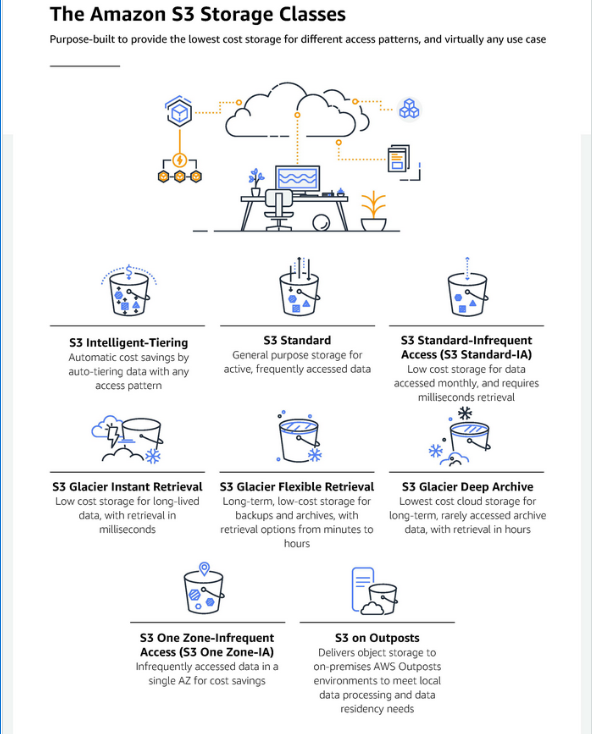

# S3 - AWS Simple Storage Service

Amazon Simple Storage Service (Amazon S3) is an object storage service that offers industry-leading scalability, data availability, security, and performance. Customers of all sizes and industries can use Amazon S3 to store and protect any amount of data for a range of use cases, such as data lakes, websites, mobile applications, backup and restore, archive, enterprise applications, IoT devices, and big data analytics. Amazon S3 provides management features so that you can optimize, organize, and configure access to your data to meet your specific business, organizational, and compliance requirements.

---

## Storage classes

### Storage classes for frequently accessed objects

- **S3 Standard** – The default storage class. If you don't specify the storage class when you upload an object, Amazon S3 assigns the S3 Standard storage class.

- **Reduced Redundancy** – The Reduced Redundancy Storage (RRS) storage class is designed for noncritical, reproducible data that can be stored with less redundancy than the S3 Standard storage class.

### Storage class for automatically optimizing data with changing or unknown access patterns

**S3 Intelligent-Tiering** is an Amazon S3 storage class that's designed to optimize storage costs by automatically moving data to the most cost-effective access tier, without performance impact or operational overhead. S3 Intelligent-Tiering is the only cloud storage class that delivers automatic cost savings by moving data on a granular object level between access tiers when access patterns change. S3 Intelligent-Tiering is the ideal storage class when you want to optimize storage costs for data that has unknown or changing access patterns. There are no retrieval fees for S3 Intelligent-Tiering.

S3 Intelligent-Tiering automatically stores objects in _three access tiers_:

- **Frequent Access** – Objects that are uploaded or transitioned to S3 Intelligent-Tiering are automatically stored in the Frequent Access tier.

- **Infrequent Access** – S3 Intelligent-Tiering moves objects that have not been accessed in 30 consecutive days to the Infrequent Access tier.

- **Archive Instant Access** – With S3 Intelligent-Tiering, any existing objects that have not been accessed for 90 consecutive days are automatically moved to the Archive Instant Access tier.

In addition to these three tiers, S3 Intelligent-Tiering offers two _optional archive access tiers_:

- **Archive Access** – S3 Intelligent-Tiering provides you with the option to activate the Archive Access tier for data that can be accessed asynchronously. After activation, the Archive Access tier automatically archives objects that have not been accessed for a minimum of 90 consecutive days.

- **Deep Archive Access** – S3 Intelligent-Tiering provides you with the option to activate the Deep Archive Access tier for data that can be accessed asynchronously. After activation, the Deep Archive Access tier automatically archives objects that have not been accessed for a minimum of 180 consecutive days.

### Storage classes for infrequently accessed objects

The S3 Standard-IA and S3 One Zone-IA storage classes are designed for long-lived and infrequently accessed data. (IA stands for infrequent access.) S3 Standard-IA and S3 One Zone-IA objects are available for millisecond access (similar to the S3 Standard storage class). Amazon S3 charges a retrieval fee for these objects, so they are most suitable for infrequently accessed data.

For older data that is accessed infrequently, but that still requires millisecond access.

- **S3 Standard-IA** – Amazon S3 stores the object data redundantly across multiple geographically separated Availability Zones (similar to the S3 Standard storage class). S3 Standard-IA objects are resilient to the loss of an Availability Zone. This storage class offers greater availability and resiliency than the S3 One Zone-IA class.

- **S3 One Zone-IA** – Amazon S3 stores the object data in only one Availability Zone, which makes it less expensive than S3 Standard-IA. However, the data is not resilient to the physical loss of the Availability Zone resulting from disasters, such as earthquakes and floods. The S3 One Zone-IA storage class is as durable as S3 Standard-IA, but it is less available and less resilient.

### Storage classes for archiving objects

The S3 Glacier Instant Retrieval, S3 Glacier Flexible Retrieval, and S3 Glacier Deep Archive storage classes are designed for low-cost data archiving.These storage classes offer the same durability and resiliency as the S3 Standard and S3 Standard-IA storage classes.

- **S3 Glacier Instant Retrieval** – Use for archiving data that is rarely accessed and requires milliseconds retrieval. Data stored in the S3 Glacier Instant Retrieval storage class offers a cost savings compared to the S3 Standard-IA storage class, with the same latency and throughput performance as the S3 Standard-IA storage class. S3 Glacier Instant Retrieval has higher data access costs than S3 Standard-IA.

- **S3 Glacier Flexible Retrieval** – Use for archives where portions of the data might need to be retrieved in minutes. Data stored in the S3 Glacier Flexible Retrieval storage class has a minimum storage duration period of 90 days and can be accessed in as little as 1-5 minutes by using an expedited retrieval. The retrieval time is flexible, and you can request free bulk retrievals in up to 5-12 hours. If you delete, overwrite, or transition the object to a different storage class before the 90-day minimum, you are charged for 90 days.

- **S3 Glacier Deep Archive** – Use for archiving data that rarely needs to be accessed. Data stored in the S3 Glacier Deep Archive storage class has a minimum storage duration period of 180 days and a default retrieval time of 12 hours. If you delete, overwrite, or transition the object to a different storage class before the 180-day minimum, you are charged for 180 days.

## Retrieving archived objects

You can set the storage class of an object to S3 Glacier Flexible Retrieval or S3 Glacier Deep Archive in the same ways that you do for the other storage classes as described in the section _Setting the storage class of an object_ . However, S3 Glacier Flexible Retrieval and S3 Glacier Deep Archive objects are not available for real-time access. You must first restore S3 Glacier Flexible Retrieval and S3 Glacier Deep Archive objects before you can access them. (S3 Standard, Reduced Redundancy Storage (RRS), S3 Standard-IA, S3 One Zone-IA, S3 Glacier Instant Retrieval, and S3 Intelligent-Tiering objects are available for anytime access.)

---

## Storage management

Amazon S3 has storage management features that you can use to manage costs, meet regulatory requirements, reduce latency, and save multiple distinct copies of your data for compliance requirements.

- **S3 Lifecycle** – Configure a lifecycle policy to manage your objects and store them cost effectively throughout their lifecycle. You can transition objects to other S3 storage classes or expire objects that reach the end of their lifetimes.

- **S3 Object Lock** – Prevent Amazon S3 objects from being deleted or overwritten for a fixed amount of time or indefinitely. You can use Object Lock to help meet regulatory requirements that require write-once-read-many (WORM) storage or to simply add another layer of protection against object changes and deletions.

- **S3 Replication** – Replicate objects and their respective metadata and object tags to one or more destination buckets in the same or different AWS Regions for reduced latency, compliance, security, and other use cases.

- **S3 Batch Operations** – Manage billions of objects at scale with a single S3 API request or a few clicks in the Amazon S3 console. You can use Batch Operations to perform operations such as Copy, Invoke AWS Lambda function, and Restore on millions or billions of objects.

---

## Access management

Amazon S3 provides features for auditing and managing access to your buckets and objects. By default, S3 buckets and the objects in them are private. You have access only to the S3 resources that you create. To grant granular resource permissions that support your specific use case or to audit the permissions of your Amazon S3 resources, you can use the following features.

- **S3 Block Public Access** – Block public access to S3 buckets and objects. By default, Block Public Access settings are turned on at the account and bucket level.

- **AWS Identity and Access Management (IAM)** – Create IAM users for your AWS account to manage access to your Amazon S3 resources. For example, you can use IAM with Amazon S3 to control the type of access a user or group of users has to an S3 bucket that your AWS account owns.

* **Bucket policies** – Use IAM-based policy language to configure resource-based permissions for your S3 buckets and the objects in them.

* **Amazon S3 access points** – Configure named network endpoints with dedicated access policies to manage data access at scale for shared datasets in Amazon S3.

* **Access control lists (ACLs)** – Grant read and write permissions for individual buckets and objects to authorized users. As a general rule, we recommend using S3 resource-based policies (bucket policies and access point policies) or IAM policies for access control instead of ACLs. ACLs are an access control mechanism that predates resource-based policies and IAM. For more information about when you'd use ACLs instead of resource-based policies or IAM policies, see _Access policy guidelines_.

* **S3 Object Ownership** – Disable ACLs and take ownership of every object in your bucket, simplifying access management for data stored in Amazon S3. You, as the bucket owner, automatically own and have full control over every object in your bucket, and access control for your data is based on policies.

* **Access Analyzer for S3** – Evaluate and monitor your S3 bucket access policies, ensuring that the policies provide only the intended access to your S3 resources.

---

## Storage logging and monitoring

Amazon S3 provides logging and monitoring tools that you can use to monitor and control how your Amazon S3 resources are being used.

Automated monitoring tools

- **Amazon CloudWatch metrics for Amazon S3** – Track the operational health of your S3 resources and configure billing alerts when estimated charges reach a user-defined threshold.

- **AWS CloudTrail** – Record actions taken by a user, a role, or an AWS service in Amazon S3. CloudTrail logs provide you with detailed API tracking for S3 bucket-level and object-level operations.

Manual monitoring tools

- **Server access logging** – Get detailed records for the requests that are made to a bucket. You can use server access logs for many use cases, such as conducting security and access audits, learning about your customer base, and understanding your Amazon S3 bill.

- **AWS Trusted Advisor** – Evaluate your account by using AWS best practice checks to identify ways to optimize your AWS infrastructure, improve security and performance, reduce costs, and monitor service quotas. You can then follow the recommendations to optimize your services and resources.

---

## Analytics and insights

Amazon S3 offers features to help you gain visibility into your storage usage, which empowers you to better understand, analyze, and optimize your storage at scale.

- **Amazon S3 Storage Lens** – Understand, analyze, and optimize your storage. S3 Storage Lens provides 29+ usage and activity metrics and interactive dashboards to aggregate data for your entire organization, specific accounts, AWS Regions, buckets, or prefixes.

- **Storage Class Analysis** – Analyze storage access patterns to decide when it's time to move data to a more cost-effective storage class.

- **S3 Inventory with Inventory reports** – Audit and report on objects and their corresponding metadata and configure other Amazon S3 features to take action in Inventory reports. For example, you can report on the replication and encryption status of your objects.

---

## Strong consistency

Amazon S3 provides strong read-after-write consistency for PUT and DELETE requests of objects in your Amazon S3 bucket in all AWS Regions. This behavior applies to both writes of new objects as well as PUT requests that overwrite existing objects and DELETE requests. In addition, read operations on Amazon S3 Select, Amazon S3 access control lists (ACLs), Amazon S3 Object Tags, and object metadata (for example, the HEAD object) are strongly consistent.

---

## How Amazon S3 works

Amazon S3 is an object storage service that stores data as objects within buckets. An object is a file and any metadata that describes the file. A bucket is a container for objects.

To store your data in Amazon S3, you first create a bucket and specify a bucket name and AWS Region. Then, you upload your data to that bucket as objects in Amazon S3.

- ### Buckets

  A bucket is a container for objects stored in Amazon S3. You can store any number of objects in a bucket and can have up to 100 buckets in your account.

  When you create a bucket, you enter a bucket name and choose the AWS Region where the bucket will reside. After you create a bucket, you cannot change the name of the bucket or its Region. Bucket names must follow the bucket naming rules. You can also configure a bucket to use S3 Versioning or other storage management features.

- ### Objects

  Objects are the fundamental entities stored in Amazon S3. Objects consist of object data and metadata. The metadata is a set of name-value pairs that describe the object. These pairs include some default metadata, such as the date last modified, and standard HTTP metadata, such as Content-Type. You can also specify custom metadata at the time that the object is stored.

  An object is uniquely identified within a bucket by a key (name) and a version ID (if S3 Versioning is enabled on the bucket).

- ### Keys

  An object key (or key name) is the unique identifier for an object within a bucket. Every object in a bucket has exactly one key. The combination of a bucket, object key, and optionally, version ID (if S3 Versioning is enabled for the bucket) uniquely identify each object. So you can think of Amazon S3 as a basic data map between "bucket + key + version" and the object itself.

  Every object in Amazon S3 can be uniquely addressed through the combination of the web service endpoint, bucket name, key, and optionally, a version. For example, in the URL https://DOC-EXAMPLE-BUCKET.s3.us-west-2.amazonaws.com/photos/puppy.jpg, DOC-EXAMPLE-BUCKET is the name of the bucket and photos/puppy.jpg is the key.

- ### S3 Versioning

  You can use S3 Versioning to keep multiple variants of an object in the same bucket. With S3 Versioning, you can preserve, retrieve, and restore every version of every object stored in your buckets. You can easily recover from both unintended user actions and application failures.

- ### Version ID

  When you enable S3 Versioning in a bucket, Amazon S3 generates a unique version ID for each object added to the bucket. Objects that already existed in the bucket at the time that you enable versioning have a version ID of null. If you modify these (or any other) objects with other operations, such as CopyObject and PutObject, the new objects get a unique version ID.

- ### Bucket policy

  A bucket policy is a resource-based AWS Identity and Access Management (IAM) policy that you can use to grant access permissions to your bucket and the objects in it. Only the bucket owner can associate a policy with a bucket. The permissions attached to the bucket apply to all of the objects in the bucket that are owned by the bucket owner. Bucket policies are limited to 20 KB in size.

  Bucket policies use JSON-based access policy language that is standard across AWS. You can use bucket policies to add or deny permissions for the objects in a bucket. Bucket policies allow or deny requests based on the elements in the policy, including the requester, S3 actions, resources, and aspects or conditions of the request (for example, the IP address used to make the request).

- ### S3 Access Points

  Amazon S3 Access Points are named network endpoints with dedicated access policies that describe how data can be accessed using that endpoint. Access Points are attached to buckets that you can use to perform S3 object operations, such as GetObject and PutObject. Access Points simplify managing data access at scale for shared datasets in Amazon S3.

  Each access point has its own access point policy. You can configure Block Public Access settings for each access point. To restrict Amazon S3 data access to a private network, you can also configure any access point to accept requests only from a virtual private cloud (VPC).

- ### Access control lists (ACLs)

  You can use ACLs to grant read and write permissions to authorized users for individual buckets and objects. Each bucket and object has an ACL attached to it as a subresource. The ACL defines which AWS accounts or groups are granted access and the type of access. ACLs are an access control mechanism that predates IAM.

  A majority of modern use cases in Amazon S3 no longer require the use of ACLs, and we recommend that you disable ACLs except in unusual circumstances where you need to control access for each object individually.

- ### Regions

  You can choose the geographical AWS Region where Amazon S3 stores the buckets that you create. You might choose a Region to optimize latency, minimize costs, or address regulatory requirements. Objects stored in an AWS Region never leave the Region unless you explicitly transfer or replicate them to another Region.
