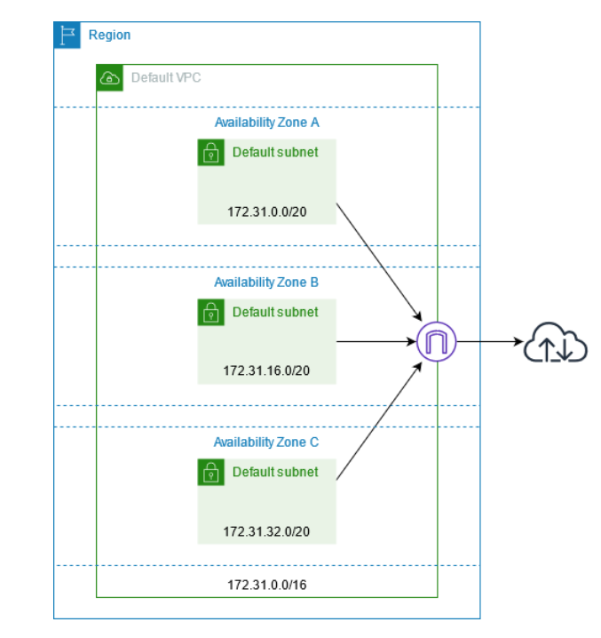

# AWS VPC - AWS Virtual Private Cloud

Amazon Virtual Private Cloud (Amazon VPC) enables you to launch AWS resources into a virtual network that you've defined. This virtual network closely resembles a traditional network that you'd operate in your own data center, with the benefits of using the scalable infrastructure of AWS. After you create a VPC, you can add subnets.

Your AWS account includes a default VPC in each AWS Region. Your default VPCs are configured such that you can immediately start launching and connecting to EC2 instances.

## Features

- Subnets

  A subnet is a range of IP addresses in your VPC. A subnet must reside in a single Availability Zone. After you add subnets, you can deploy AWS resources in your VPC.

- IP addressing

  You can assign IPv4 addresses and IPv6 addresses to your VPCs and subnets. You can also bring your public IPv4 and IPv6 GUA addresses to AWS and allocate them to resources in your VPC, such as EC2 instances, NAT gateways, and Network Load Balancers.

- Routing

  Use route tables to determine where network traffic from your subnet or gateway is directed. Each route in a route table specifies the range of IP addresses where you want the traffic to go (the destination) and the gateway, network interface, or connection through which to send the traffic (the target).

- Gateways and endpoints

  A gateway connects your VPC to another network. For example, use an internet gateway to connect your VPC to the internet. Use a VPC endpoint to connect to AWS services privately, without the use of an internet gateway or NAT device.

- Peering connections

  Use a VPC peering connection to route traffic between the resources in two VPCs.

- Traffic Mirroring

  Copy network traffic from network interfaces and send it to security and monitoring appliances for deep packet inspection.

- Transit gateways

  Use a transit gateway, which acts as a central hub, to route traffic between your VPCs, VPN connections, and AWS Direct Connect connections.

- VPC Flow Logs

  A flow log captures information about the IP traffic going to and from network interfaces in your VPC.

- VPN connections

  Connect your VPCs to your on-premises networks using AWS Virtual Private Network (AWS VPN).
